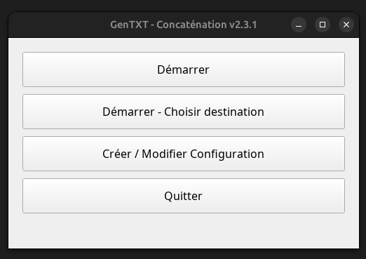
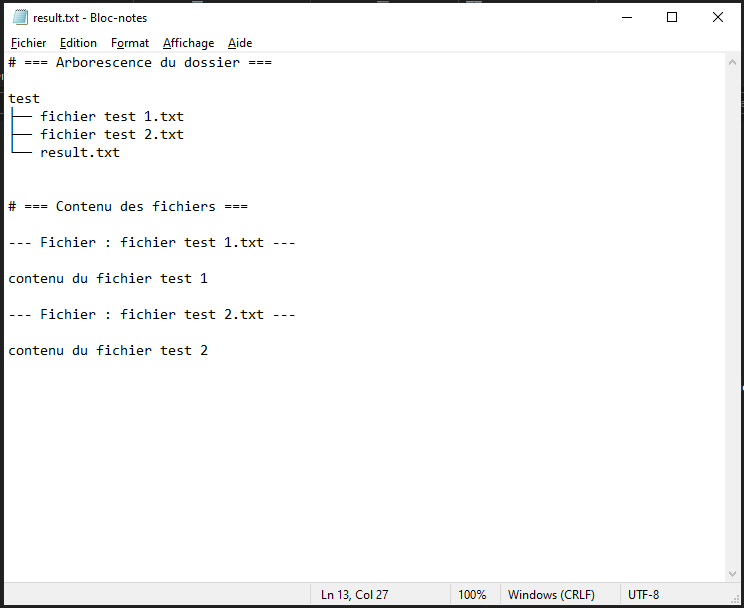

# GenTXT

## Présentation

GenTXT est un outil de concaténation de fichiers permettant de générer un fichier texte unique contenant à la fois l’arborescence d’un dossier et le contenu de ses fichiers.
Il est conçu pour faciliter l’export de projets sous forme de texte exploitable, notamment pour l’analyse automatique (par exemple par un LLM).

## Fonctionnalités

- Interface graphique (UI)
- Exclusion configurable de fichiers et de dossiers via un fichier JSON
- Fonctionnement en ligne de commande (CLI)
- Support multiplateforme (objectif en cours de développement)

## Cas d’usage

Vous disposez d’un dossier contenant plusieurs fichiers et souhaitez les regrouper dans un seul fichier `.txt`, par exemple afin de le fournir à un modèle de langage ou de l’archiver sous forme textuelle.
GenTXT automatise cette opération en produisant un fichier texte unique regroupant l’ensemble des fichiers du dossier.

Il suffit d’indiquer le chemin du dossier à GenTXT pour obtenir un fichier `.txt` contenant tous les fichiers concaténés ainsi que leur organisation.

## Interface

Interface graphique :

Résultat généré :

## Exclusion de fichiers

Pour exclure certains fichiers ou dossiers (par exemple `fichier_a_exclure.txt`), il suffit de créer un fichier nommé `.concat_config.json` dans le dossier cible et d’y lister les éléments à exclure.
Ces éléments ne seront alors pas inclus dans le fichier final généré.

## Utilisation

GenTXT peut être utilisé :

- en interface graphique (GUI),
- ou en ligne de commande (CLI).

## Utilisation 

En interface graphique ou en cli.

## Documentation complète

-> [Docs](https://croissant-and-green-tea.github.io/GenTXT/) 

## Licence

Voir [LICENSE](LICENSE).

